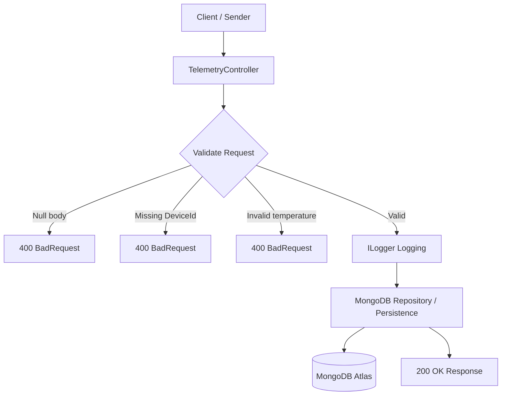
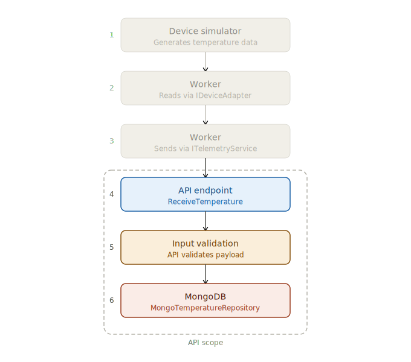

# Temperature Telemetry API (.NET)

A lightweight ASP.NET Core Web API for ingesting temperature telemetry from industrial devices.

This project is designed to reflect real-world industrial scenarios where devices send sensor data to a backend system (e.g. SCADA, IIoT platform, monitoring service).

---

## Why I built this

I built this API as part of an industrial software simulation:

- To represent a **device → backend communication layer**
- To integrate with a **.NET Worker Service (Industrial Gateway)**
- To practice **clean API design, DTOs, and HTTP communication**

This API acts as the **receiver of telemetry data** in an IIoT pipeline.

---

## Industrial Context

This API simulates a real-world scenario where:

- PLCs or edge devices send telemetry data
- A gateway aggregates and forwards data
- Backend systems process and visualize data

Typical use cases:
- Machine condition monitoring
- Temperature tracking in production lines
- Predictive maintenance systems

---

## Tech Stack

- .NET 8 / .NET 10 (depending on your setup)
- ASP.NET Core Web API
- Swagger (OpenAPI)
- C#

---

## Architecture

This API follows a simple layered structure where the controller handles HTTP interaction, while persistence is abstracted via a repository pattern.

## Data Flow inside API



## Components

- **TelemetryController**
  - Entry point for incoming HTTP requests
  - Handles validation, saving into database and response formatting

- **TemperatureReading (Model)**
  - Represents the telemetry data structure
  - Contains DeviceId, Value, TimestampUtc

- **ITemperatureRepository**
  - Defines the contract for data persistence
  - Decouples controller from database implementation

- **MongoTemperatureRepository**
  - Implements data storage using MongoDB
  - Handles communication with MongoDB Atlas

- **Program.cs**
  - Configures dependency injection
  - Registers services and application pipeline

---

## How to Run

### 1. Clone the repository

```bash
git clone https://github.com/Ham15-art/temperature-telemetry-api-dotnet.git
```

### 2. Configure Cloud Database (MongoDB)

1. Create MongoDB Atlas cluster
2. Create Database user
3. Connect: Add connection string to `appsettings.json`

### 2. Run the API

```bash
dotnet run
```

---

## Access the API

once running, open Swagger UI: http://localhost:5244/swagger 
(Port will be shown in the console)

---

## API Endpoints

### Endpoint

POST /temperature

### Send Temperature Data

example request:
```json
{
  "deviceId": "device-123",
  "value": 23.5,
  "timestampUtc": "2026-04-09T12:00:00Z"
}
```
example response:
```json
{
  "status": "received",
  "message": "Temperature reading is accepted",
  "data": {
    "deviceId": "device-123",
    "value": 23.5,
    "timestampUtc": "2026-04-09T12:00:00Z"
  }
}
```
> Note: JSON uses camelCase naming, while C# models use PascalCase.
> ASP.NET Core automatically maps between them.

---

## Testing the API

### Option 1: SWAGGER UI

- Open Swagger UI
- Try the POST endpoint directly

### Option 2: curl

```bash
curl -X POST http://localhost:5244/temperature \
  -H "Content-Type: application/json" \
  -d '{"deviceId":"sensor-123","value":25, "timestampUtc": "2026-04-11T13:22:51.996Z"}'
```
---

## Validation Rules

The API validates incoming telemetry data:

- Request must not be Null
- `deviceId` must not be empty
- `value` must be within realistic bounds (-50 to 150 °C)

Invalid requests return HTTP 400 with a descriptive message.

## Responses

- `200 OK` → Data received successfully
- `400 Bad Request` → Invalid input data

## Example Log Output

### Successful request

```text
info: TemperatureApi.Controllers.TelemetryController[0]
      Request Received
info: TemperatureApi.Controllers.TelemetryController[0]
      DeviceId: Sensor1
info: TemperatureApi.Controllers.TelemetryController[0]
      Temperature value: 48.1302667150544
info: TemperatureApi.Controllers.TelemetryController[0]
      Timestamp: 04/17/2026 08:17:45
info: TemperatureApi.Controllers.TelemetryController[0]
      Temperature reading accepted
info: TemperatureApi.Repositories.MongoTemperatureRepository[0]
      Saved reading to MongoDB for Sensor1 with value 48.1302667150544
```
### Unsuccessful request

```text
info: TemperatureApi.Controllers.TelemetryController[0]
      Request Received
info: TemperatureApi.Controllers.TelemetryController[0]
      DeviceId: 
info: TemperatureApi.Controllers.TelemetryController[0]
      Temperature value: 42.53274992816768
info: TemperatureApi.Controllers.TelemetryController[0]
      Timestamp: 04/17/2026 08:16:50
warn: TemperatureApi.Controllers.TelemetryController[0]
      Validation failed: DeviceId missing
```
---

## Integration Example

This API is designed to integrate with the Industrial Gateway (.NET Worker Service):

Data Flow:



1. Device simulator generates temperature data
2. Worker reads data via `IDeviceAdapter`
3. Worker sends data periodically via `ITelemetryService` using HTTP POST
4. API receives data (`ReceiveTemperature`)
5. API validates input
6. API stores data in Cloud Database (`MongoTemperatureRepository`)

---

## What this project demonstrates:

- RESTful API design in ASP.NET Core
- DTO-based data contracts (TemperatureReading)
- Integration with distributed systems (Worker Service)
- Simulation of industrial telemetry pipelines (IIoT)
- Clean and extensible backend architecture
- Integration of a Cloud Database for persistence

---

## Possible Improvements:

- Add structured validation using FluentValidation
- Add Authentication & Authorization
- Add Unit & Integration Tests

---

## Author

Hamza Maach
Industrial Software Developer
Focus: Automation, IIoT, .NET, SCADA systems, HMI