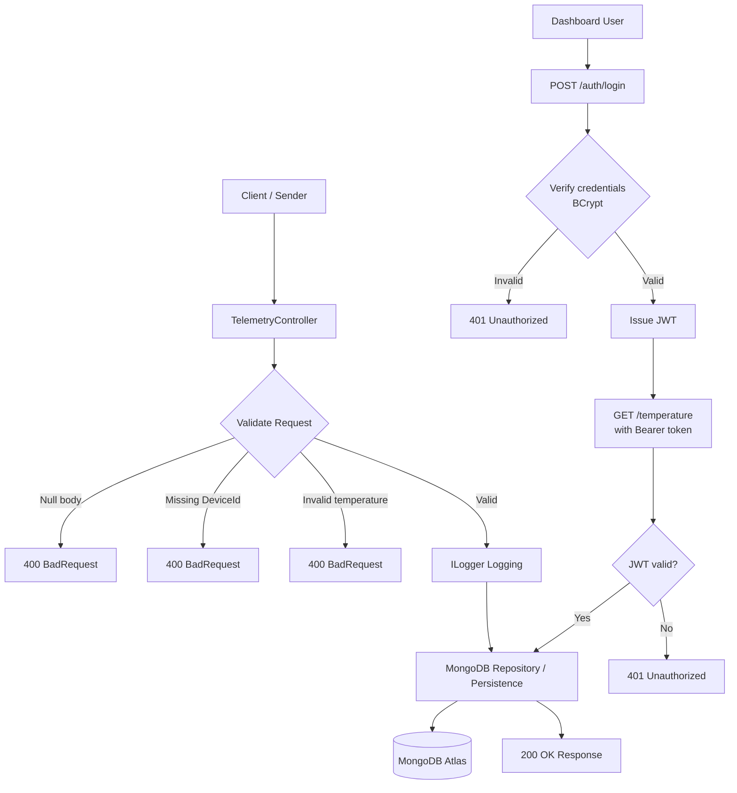
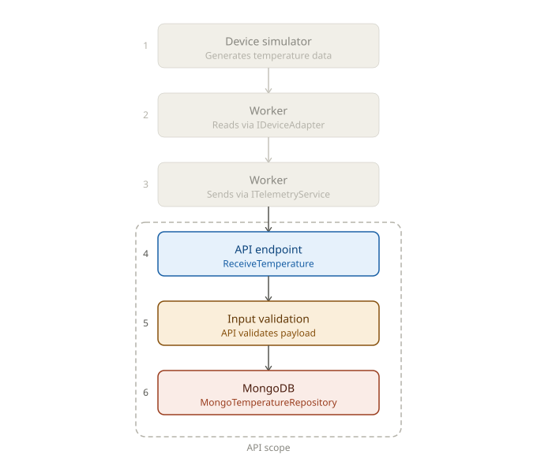

# Temperature Telemetry API (.NET)

A lightweight ASP.NET Core Web API for ingesting temperature telemetry from industrial devices, with JWT-based authentication protecting human-facing dashboard access.

This project is designed to reflect real-world industrial scenarios where devices send sensor data to a backend system (e.g. SCADA, IIoT platform, monitoring service).

---

## Why I built this

I built this API as part of an industrial software simulation:

- To represent a **device → backend communication layer**
- To integrate with a **.NET Worker Service (Industrial Gateway)**
- To practice **clean API design, DTOs, and HTTP communication**
- To practice **authentication and trust boundaries** in a system with two very different kinds of clients: machines and humans

This API acts as the **receiver of telemetry data** and the **authenticated data source for a human-facing dashboard** in an IIoT pipeline.

---

## Industrial Context

This API simulates a real-world scenario where:

- PLCs or edge devices send telemetry data
- A gateway aggregates and forwards data
- Backend systems process and visualize data for human operators

Typical use cases:
- Machine condition monitoring
- Temperature tracking in production lines
- Predictive maintenance systems

---

## Tech Stack

- .NET 8 / .NET 10 (depending on your setup)
- ASP.NET Core Web API
- JWT Bearer authentication (HMAC-SHA256)
- BCrypt.Net for password hashing
- Swagger (OpenAPI)
- MongoDB Atlas
- C#

---

## Architecture

This API follows a simple layered structure where controllers handle HTTP interaction, persistence is abstracted via a repository pattern, and authentication is handled by ASP.NET Core's built-in JWT Bearer middleware.

Two client types interact with this API, and they are treated differently on purpose:

- **`IndustrialGateway.Worker`** (a .NET Worker Service simulating an edge gateway) posts telemetry via `POST /temperature`. This endpoint is intentionally **not** protected by `[Authorize]`.
- **Human dashboard users** read telemetry via `GET /temperature` and `GET /temperature/latest`. These endpoints **require** a valid JWT.

### Why `POST /temperature` is open

In a production system, device-to-API trust would instead be established with **API keys, mutual TLS (mTLS), or network-level isolation** — mechanisms designed for machine-to-machine trust rather than human login. This project currently leaves `POST /temperature` open to keep the focus on the human-authentication path.

## Data Flow inside API


```mermaid
flowchart TD
    A[Client / Sender] --> B[TelemetryController]
    B --> C{Validate Request}

    C -->|Null body| D[400 BadRequest]
    C -->|Missing DeviceId| E[400 BadRequest]
    C -->|Invalid temperature| F[400 BadRequest]

    C -->|Valid| G[ILogger Logging]
    G --> H[MongoDB Repository / Persistence]
    H --> I[(MongoDB Atlas)]
    H --> J[200 OK Response]

    K[Dashboard User] --> L[POST /auth/login]
    L --> M{Verify credentials\nBCrypt}
    M -->|Invalid| N[401 Unauthorized]
    M -->|Valid| O[Issue JWT]
    O --> P[GET /temperature\nwith Bearer token]
    P --> Q{JWT valid?}
    Q -->|No| R[401 Unauthorized]
    Q -->|Yes| H
```

## Components

- **TelemetryController**
  - Entry point for incoming HTTP requests
  - `POST /temperature`: open, no auth required (simulated trusted device traffic)
  - `GET /temperature`, `GET /temperature/latest`: require a valid JWT (`[Authorize]`)
  - Handles validation, saving into database and response formatting

- **AuthController**
  - `POST /auth/login`: verifies username/password (BCrypt-hashed) and issues a signed JWT on success
  - Currently backed by a single hardcoded admin user; swapping in a MongoDB-backed user store is a planned improvement

- **TemperatureReading (Model)**
  - Represents the telemetry data structure
  - Contains DeviceId, Value, TimestampUtc

- **LoginRequest (Model)**
  - Represents the login payload: Username, Password

- **ITemperatureRepository**
  - Defines the contract for data persistence
  - Decouples controller from database implementation

- **MongoTemperatureRepository**
  - Implements data storage using MongoDB
  - Handles communication with MongoDB Atlas

- **Program.cs**
  - Configures dependency injection
  - Registers JWT Bearer authentication and authorization
  - Configures the middleware pipeline in the required order: `UseCors` → `UseAuthentication` → `UseAuthorization` → `MapControllers`

---

## How to Run

### 1. Clone the repository

```bash
git clone https://github.com/Ham15-art/temperature-telemetry-api-dotnet.git
```

### 2. Configure secrets (MongoDB + JWT)

This project improvement keeps secrets out of `appsettings.json` on purpose — connection strings and signing keys should never be committed to source control. Use [.NET user secrets](https://learn.microsoft.com/en-us/aspnet/core/security/app-secrets) for local development:

```bash
dotnet user-secrets init
dotnet user-secrets set "MongoDb:ConnectionString" "your-mongodb-atlas-connection-string"
dotnet user-secrets set "Jwt:Key" "a-long-random-signing-key-at-least-32-characters"
```

`appsettings.json` should only contain non-secret defaults (issuer, audience, token expiry). In a deployed environment, the same keys are supplied via environment variables instead of user secrets.

`.gitignore` also defends against secrets landing in the repo by other paths later: environment-specific config files (`appsettings.Production.json`, `appsettings.*.Local.json`), `.env` files, and certificate/private key files (`*.pfx`, `*.pem`, `*.key`) are all excluded, even though none of them exist in this project yet. The goal is that adding one of those files in the future can't silently reintroduce the same mistake.

### 3. Run the API

```bash
dotnet run
```

---

## Access the API

once running, open Swagger UI: http://localhost:5244/swagger
(Port will be shown in the console)

---

## API Endpoints

### Authenticate

`POST /auth/login`

example request:
```json
{
  "username": "admin",
  "password": "admin123"
}
```
example response (200 OK):
```json
{
  "token": "eyJhbGciOiJIUzI1NiIsInR5cCI6IkpXVCJ9..."
}
```
example response (401 Unauthorized):
```json
{
  "error": "Invalid credentials"
}
```
The token is valid for 60 minutes by default (`Jwt:ExpiryMinutes` in configuration) and must be sent as `Authorization: Bearer <token>` on protected endpoints.

### Send Temperature Data (open, no auth)

`POST /temperature`

example request:
```json
{
  "deviceId": "device-123",
  "value": 23.5,
  "timestampUtc": "2026-04-09T12:00:00Z"
}
```
example response:
```json
{
  "status": "received",
  "message": "Temperature reading is accepted",
  "data": {
    "deviceId": "device-123",
    "value": 23.5,
    "timestampUtc": "2026-04-09T12:00:00Z"
  }
}
```
> Note: JSON uses camelCase naming, while C# models use PascalCase.
> ASP.NET Core automatically maps between them.

### Read Temperature Data (requires JWT)

`GET /temperature` and `GET /temperature/latest`

Requires header: `Authorization: Bearer <token>`

Returns `401 Unauthorized` if the header is missing, malformed, or the token is expired/invalid.

---

## Testing the API

### Option 1: SWAGGER UI

- Open Swagger UI
- Try `POST /auth/login` to get a token
- Click "Authorize" and paste `Bearer <token>` to unlock the protected `GET` endpoints
- Try the `POST /temperature` endpoint directly — no token needed

### Option 2: curl

```bash
# Post a reading (no auth required)
curl -X POST http://localhost:5244/temperature \
  -H "Content-Type: application/json" \
  -d '{"deviceId":"sensor-123","value":25, "timestampUtc": "2026-04-11T13:22:51.996Z"}'

# Log in to get a token
curl -X POST http://localhost:5244/auth/login \
  -H "Content-Type: application/json" \
  -d '{"username":"admin","password":"admin123"}'

# Read data using the token from the response above
curl http://localhost:5244/temperature \
  -H "Authorization: Bearer <token>"
```
---

## Validation Rules

The API validates incoming telemetry data:

- Request must not be Null
- `deviceId` must not be empty
- `value` must be within realistic bounds (-50 to 150 °C)

Invalid requests return HTTP 400 with a descriptive message.

Login requests are validated against a stored (hashed) credential; invalid username or password returns HTTP 401.

## Responses

- `200 OK` → Data received / returned successfully
- `400 Bad Request` → Invalid input data
- `401 Unauthorized` → Missing/invalid credentials, or missing/invalid/expired JWT

## Example Log Output

### Successful request

```text
info: TemperatureApi.Controllers.TelemetryController[0]
      Request Received
info: TemperatureApi.Controllers.TelemetryController[0]
      DeviceId: Sensor1
info: TemperatureApi.Controllers.TelemetryController[0]
      Temperature value: 48.1302667150544
info: TemperatureApi.Controllers.TelemetryController[0]
      Timestamp: 04/17/2026 08:17:45
info: TemperatureApi.Controllers.TelemetryController[0]
      Temperature reading accepted
info: TemperatureApi.Repositories.MongoTemperatureRepository[0]
      Saved reading to MongoDB for Sensor1 with value 48.1302667150544
```
### Unsuccessful request

```text
info: TemperatureApi.Controllers.TelemetryController[0]
      Request Received
info: TemperatureApi.Controllers.TelemetryController[0]
      DeviceId: 
info: TemperatureApi.Controllers.TelemetryController[0]
      Temperature value: 42.53274992816768
info: TemperatureApi.Controllers.TelemetryController[0]
      Timestamp: 04/17/2026 08:16:50
warn: TemperatureApi.Controllers.TelemetryController[0]
      Validation failed: DeviceId missing
```
---

## Integration Example

This API is designed to integrate with the Industrial Gateway (.NET Worker Service):

Data Flow:



1. Device simulator generates temperature data
2. Worker reads data via `IDeviceAdapter`
3. Worker sends data periodically via `ITelemetryService` using HTTP POST — no authentication required, since the Worker cannot perform an interactive login
4. API receives data (`ReceiveTemperature`)
5. API validates input
6. API stores data in Cloud Database (`MongoTemperatureRepository`)
7. A dashboard user separately authenticates via `POST /auth/login` and uses the resulting JWT to read stored data via `GET /temperature`

---

## What this project demonstrates:

- RESTful API design in ASP.NET Core
- DTO-based data contracts (TemperatureReading, LoginRequest)
- JWT authentication and authorization, with a deliberate split between machine and human trust boundaries
- Password hashing with BCrypt
- Integration with distributed systems (Worker Service)
- Simulation of industrial telemetry pipelines (IIoT)
- Clean and extensible backend architecture
- Integration of a Cloud Database for persistence
- Secrets management via .NET user secrets / environment variables, kept out of source control
- Defensive `.gitignore` hardening against future accidental secret exposure (env files, certs/keys, environment-specific config)

---

## Possible Improvements:

- Replace the hardcoded admin user with a MongoDB-backed user store
- Add structured validation using FluentValidation
- Add refresh tokens so users aren't logged out every 60 minutes
- Add device-level authentication (API key or mTLS) for `POST /temperature`
- Add Unit & Integration Tests

---

## Author

Hamza Maach
Industrial Software Developer
Focus: Automation, IIoT, .NET, SCADA systems, HMI
